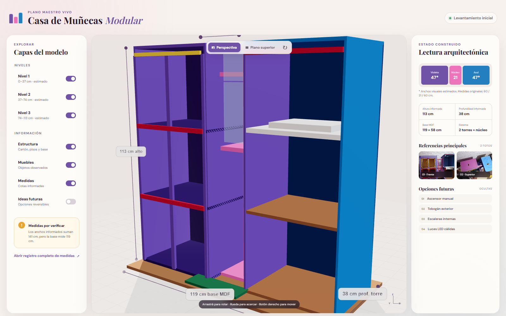
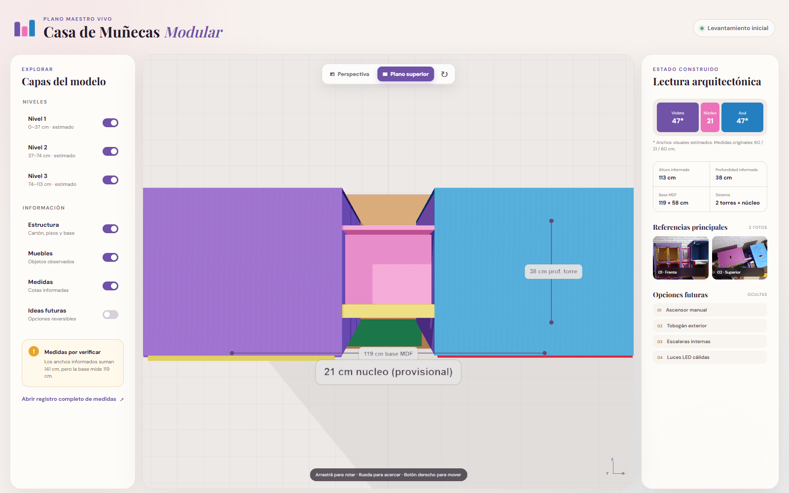

# Casa de Muñecas Modular

Plano maestro vivo de una casa de muñecas artesanal construida con dos cajas grandes de cartón, un núcleo central de conexión y una base de MDF.

Este repositorio conserva el estado real de la construcción, las fotografías de referencia, todas las medidas conocidas, las decisiones de diseño y un modelo 3D navegable. La regla principal es **reutilizar lo construido antes de proponer cambios estructurales**.

## Ver el modelo 3D

El visor está publicado desde la carpeta `viewer/` y lee toda la geometría desde `model/casa.json`.

Para abrirlo localmente, serví la raíz del repositorio con cualquier servidor web estático y abrí `viewer/`. No funciona correctamente abriendo `index.html` directamente porque el navegador bloquea la lectura local del JSON.

Controles disponibles:

- Rotar, acercar y desplazar la cámara.
- Cambiar entre perspectiva frontal y vista superior tipo plano.
- Activar o desactivar cada nivel.
- Mostrar medidas, estructura, muebles y ampliaciones futuras.
- Restablecer la vista.

## Vistas verificadas

## Estado inicial

- Torre izquierda violeta, cerrada por laterales y fondo, con tres niveles y fachada decorada.
- Torre derecha azul, abierta al frente, con niveles interiores parciales.
- Núcleo central rosado unido mediante puentes de cartón.
- Base de MDF.
- Ascensor manual, tobogán exterior, escaleras y luces LED registrados como ideas futuras opcionales, apagadas por defecto.

## Precisión dimensional

Las medidas originales se preservan en `docs/medidas.md` y `model/casa.json`. Existe una incompatibilidad pendiente de verificación: dos módulos de 60 cm más un núcleo de 21 cm suman 141 cm, pero la base informada mide 119 cm. La implantación del modelo es provisional y está marcada como estimada; no sustituye una medición física.

## Estructura

- `docs/`: documentación viva, decisiones, medidas, materiales y tareas.
- `model/`: geometría estructurada e historial de cambios.
- `viewer/`: visor 3D Three.js impulsado únicamente por `casa.json`.
- `assets/photos/`: fotografías originales numeradas, nunca reemplazadas.
- `assets/renders/`: referencias gráficas y futuros renders del modelo.
- `assets/textures/`: texturas futuras.
- `prompts/`: consignas y criterios de actualización del proyecto.
